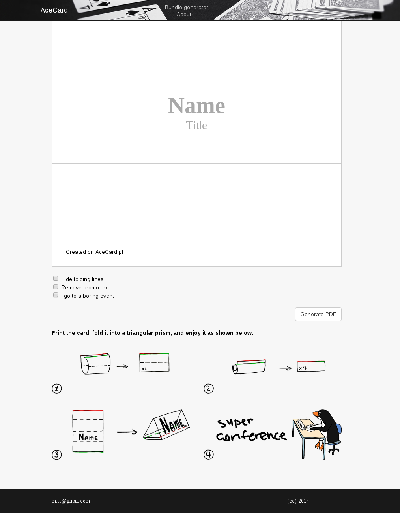

# [AceCard.pl]

Once, I have been in a new biology class and the teacher said that it would have been great if everyone had had a place card with their name on their desks. The next class day I brought printouts with names of my classmates which could be folded into prisms and used as place cards. I made the cards manually, but with all my love to optimization, I decided to make it into a mock project to implement which I had to get acquired with web development.

This service allows a user to enter their name and receive a PDF with their name correctly position on a page. The PDF should be printed and folded according to the instruction on the main page of the website (the main page is shown below). The service also allows to create multiple place cards in one click.

Unfourtunately, today the service is down, i.e. no PDF could be generated, and only a static version is avaiable for reference and nostalgy.

## License
See the [LICENSE](LICENSE.md) file for license rights and limitations (MIT).

## Attribution
Some things such that the tcpdf library, fonts, and [Uspensky's rhymes](uspenskiy.txt) in this repo belong to their owners and I do not claim any ownership of any of these.

   [AceCard.pl]: <https://murfel.github.io/acecard.pl/>
